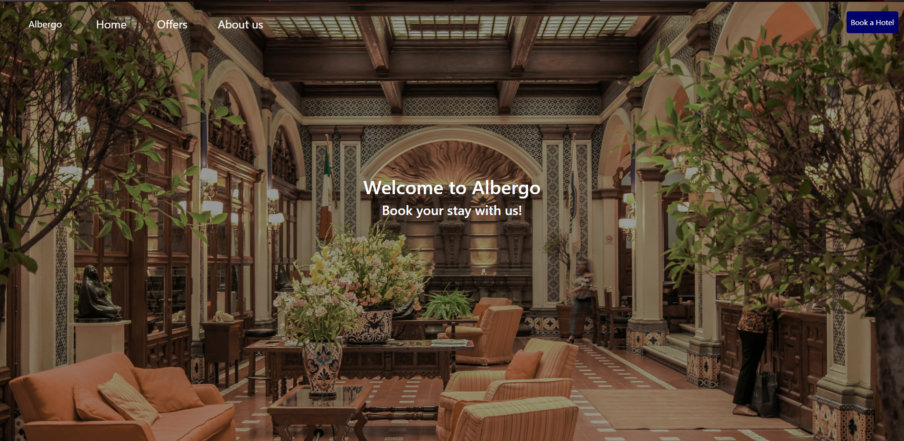
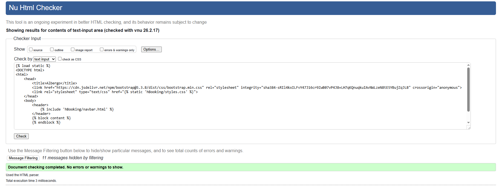
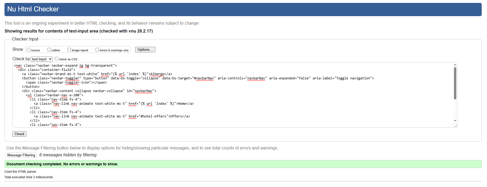
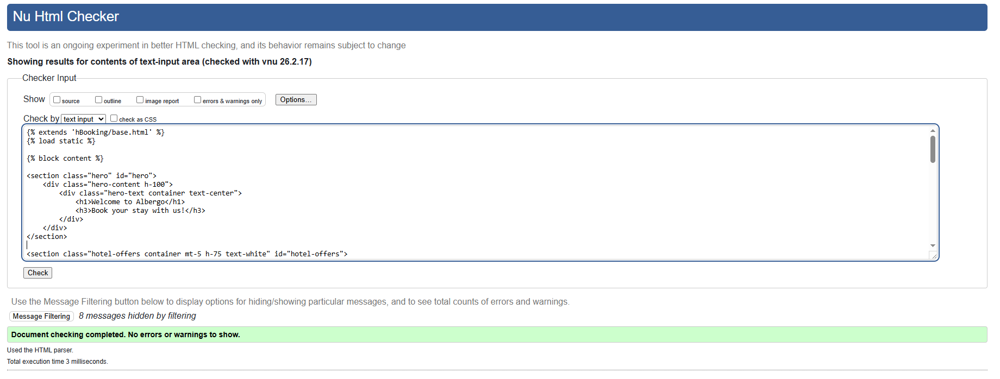
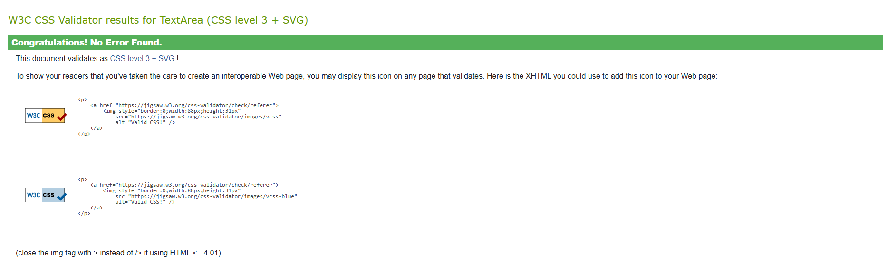

# Project 4

Albergo is a modern and user-friendly hotel booking website designed to make reserving your perfect stay simple and convenient. With a clean interface, and a seamless reservation process, Albergo allows guests to explore accommodations, compare choices, and book with confidence. Whether for business or leisure, Albergo provides a smooth and reliable experience from browsing to checkout.

## Features

- __Navigation Bar__
  - Featured on all three pages, the navigation bar includes links to the Logo, Home Page, Offers, About Us and Booking page.
  

- __Landing Page__
  - This section introduces the user the lobby of the hotel to grab their attention.
  

- __Offers__
  - This section shows the user the different offers that the website provides.
 

- __Booking__
  - This page allows the user to book a room by entering their personal details, selecting a check-in and check-out dates, and choosing a room type.
 
  

- __Booking Success__
  - After submitting the form, the website will provide feedback by showing to the user that the submission was successful.

## Testing

The website has been tested on different devices such as phone, desktop and notebooks. The sizes adjust as per device.

__Validator Testing__

- HTML
  - No errors were return when passing through the official [W3C_validator]
 
  - Base
  

  - Navigation bar
  

  - Index
  

  - Booking
   

  - Booking Success
  

- CSS
  - No errors were returned when passing through the official [(Jigsaw)_validator]
  

## Deployment

## Credits

__Content__

- CSS implementation was from [Bootstrap](https://getbootstrap.com/)
- Django implementation was from [djangoproject.com](https://www.djangoproject.com/start/overview/)
- Database implementation was from [djangoproject.com](https://docs.djangoproject.com/en/6.0/ref/databases/)

__Media__
- The photos used for the background and about you section is from [www.pinterest.com/](https://ph.pinterest.com/pin/470555861087312807/) and [www.pinterest.com/](https://ph.pinterest.com/pin/1022739396629948470/)
- The photos used for the landing page is from [www.worldwidemenus.com/](https://www.worldwidemenus.com/blogs/news/7-outstanding-small-hotel-lobby-design-ideas)
- The photo used for the offer section is from [myokosilverhorn.com](https://myokosilverhorn.com/winter/accommodations/), [archello.com](https://archello.com/product/60102/attachments/photos-videos/1) and [solanohotels.com](https://www.solanohotels.com/rooms/deluxe-room/)
